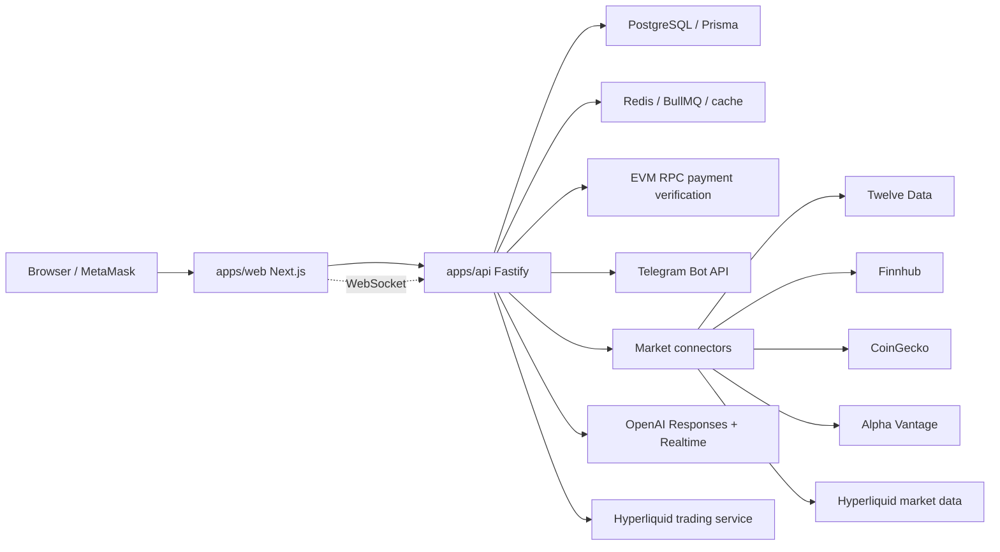

# OmniSignal

OmniSignal is a production-oriented full-stack trading intelligence platform. It replaces the original single-file prototype with a monorepo containing a Next.js portal, Fastify API, PostgreSQL database, Redis cache/job layer, signed MetaMask wallet authentication, wallet-paid Premium subscriptions, Telegram AI messaging, live market-data connectors, OpenAI analysis, OpenAI Realtime voice sessions, and Hyperliquid order-intent flows.

Production code does not substitute provider data. If a provider key, database, Redis, OpenAI, or Hyperliquid configuration is missing, the API returns a clear unavailable state and the UI renders that state.

## Architecture



## Repo Structure

- `apps/web`: Next.js TypeScript portal.
- `apps/api`: Fastify TypeScript API, WebSocket gateway, Prisma, jobs, auth.
- `packages/shared`: shared types, constants, Zod validators, errors.
- `packages/market-connectors`: Twelve Data, Finnhub, CoinGecko, Alpha Vantage, Hyperliquid market data.
- `packages/ai`: OpenAI structured analysis and Realtime voice session creation.
- `packages/trading`: Hyperliquid safety checks, estimates, simulation calculations, execution adapter.
- `packages/ui`: shared OmniSignal theme constants.

## Setup

1. Install Node 20+ and pnpm 9+.
2. Copy `.env.example` to `.env`.
3. Fill required environment variables.
4. Start infrastructure:

```bash
docker compose up -d
```

5. Install dependencies:

```bash
pnpm install
```

6. Generate Prisma client and apply migrations:

```bash
pnpm db:generate
pnpm db:migrate
```

7. Run locally:

```bash
pnpm dev
```

Frontend: `http://localhost:3000`  
Backend: `http://localhost:4000`

## Environment Variables

Required for local runtime:

- `DATABASE_URL`: PostgreSQL connection string.
- `REDIS_URL`: Redis connection string.
- `JWT_SECRET`: at least 32 characters.
- `CORS_ALLOWED_ORIGINS`: comma-separated frontend origins.
- `NEXT_PUBLIC_API_URL`: public API URL for the web app.
- `NEXT_PUBLIC_WS_URL`: public WebSocket URL for live prices.

Provider keys:

- `TWELVE_DATA_API_KEY`
- `FINNHUB_API_KEY`
- `COINGECKO_API_KEY`
- `ALPHA_VANTAGE_API_KEY`
- `OPENAI_API_KEY`
- `OPENAI_REALTIME_MODEL`

Trading:

- `DISABLE_TRADING=true` by default.
- `TRADING_MODE=simulation | testnet | mainnet`.
- `ENABLE_MAINNET_TRADING=false` by default.
- `HYPERLIQUID_NETWORK=testnet`.
- `HYPERLIQUID_API_BASE`.
- `HYPERLIQUID_WS_URL`.
- `HYPERLIQUID_AGENT_PRIVATE_KEY` for server-side testnet/mainnet placement.
- `HYPERLIQUID_TAKER_FEE_BPS` for estimates.

Premium subscription:

- `PREMIUM_PRICE_USD=25`: fixed premium payment amount.
- `PREMIUM_SUBSCRIPTION_DAYS=30`: subscription length.
- `PREMIUM_TREASURY_ADDRESS`: your receiving wallet.
- `PREMIUM_PAYMENT_NETWORK_NAME`: for example `Base`.
- `PREMIUM_PAYMENT_CHAIN_ID`: for Base mainnet, `8453`.
- `PREMIUM_PAYMENT_TOKEN_SYMBOL`: for example `USDC`.
- `PREMIUM_PAYMENT_TOKEN_ADDRESS`: ERC-20 token contract.
- `PREMIUM_PAYMENT_TOKEN_DECIMALS`: usually `6` for USDC.
- `EVM_RPC_URL`: backend RPC URL used to verify the payment transaction.

Messaging:

- `TELEGRAM_BOT_TOKEN`
- `TELEGRAM_BOT_USERNAME`
- `TELEGRAM_WEBHOOK_SECRET`

Do not put provider keys, OpenAI keys, RPC keys, Telegram bot tokens, or Hyperliquid agent keys in the frontend.

## Database

Prisma schema lives at `apps/api/prisma/schema.prisma`. The initial migration creates:

- users, wallets, wallet nonces
- portfolios, positions, snapshots, transactions, simulations
- news events, AI signals, AI nudges
- order intents, executed orders
- wallet-paid Premium subscriptions, payment records, messaging links
- provider status and audit logs

No user portfolios are seeded.

## Redis

Redis is used for:

- provider/cache-ready infrastructure
- BullMQ signal ingestion scheduler
- future pub/sub broadcast expansion

The signal ingestion worker schedules a five-minute GDELT refresh job.

## Providers

The API talks to providers server-side only. The frontend never receives API keys.

- Market heatmap: `/market/heatmap`
- Quotes: `/market/quote/:symbol`, `/market/quotes`
- Candles: `/market/candles`
- Provider status: `/health/providers`
- WebSocket live prices: `/market/live?symbols=BTC,ETH`

If every configured provider fails for a request, the API returns an error and the UI renders an unavailable state.

## OpenAI

AI analysis uses structured JSON and validates responses with Zod before saving or rendering.

- Asset analysis: `/ai/analyze/asset`
- Portfolio analysis: `/ai/analyze/portfolio`
- Nudge generation: `/ai/nudge`
- Order explanation: `/ai/explain-order`
- Realtime voice session: `/ai/voice/session`

Voice uses a short-lived token minted by the backend, then the browser connects to OpenAI Realtime over WebRTC.

## MetaMask

Wallet auth uses signed nonce verification:

1. `GET /auth/wallet/nonce?address=`
2. Browser asks MetaMask to sign the returned message.
3. `POST /auth/wallet/verify`
4. Backend verifies the signature with `ethers`.
5. Backend creates a JWT session and wallet record.

No seed phrase or private key is requested or stored.

## Wallet-Paid Premium Subscription

The Premium flow uses MetaMask and backend on-chain verification:

1. User connects and signs with MetaMask.
2. User clicks `Premium $25`.
3. Backend creates a payment intent for the configured chain, token, and treasury wallet.
4. Frontend asks MetaMask to send the ERC-20 payment.
5. Backend verifies the transaction receipt and ERC-20 `Transfer` event through `EVM_RPC_URL`.
6. Backend marks that wallet Premium and writes an audit log.

No subscription is activated from a browser-only state. Premium is activated only after the backend verifies the on-chain transfer.

Premium unlocks:

- more portfolios
- more AI nudges
- live-update entitlement flag
- Telegram AI messaging

## Hyperliquid Testnet

Simulation is default. Testnet placement requires:

- `DISABLE_TRADING=false`
- `TRADING_MODE=testnet`
- `HYPERLIQUID_NETWORK=testnet`
- testnet `HYPERLIQUID_AGENT_PRIVATE_KEY`
- `HYPERLIQUID_TAKER_FEE_BPS`

Flow:

1. User creates an order intent.
2. Backend estimates against Hyperliquid order-book data.
3. User visually confirms the ticket.
4. Backend validates safety controls.
5. Backend submits to Hyperliquid testnet and stores the response.

Mainnet remains disabled unless `ENABLE_MAINNET_TRADING=true` and `TRADING_MODE=mainnet`.
